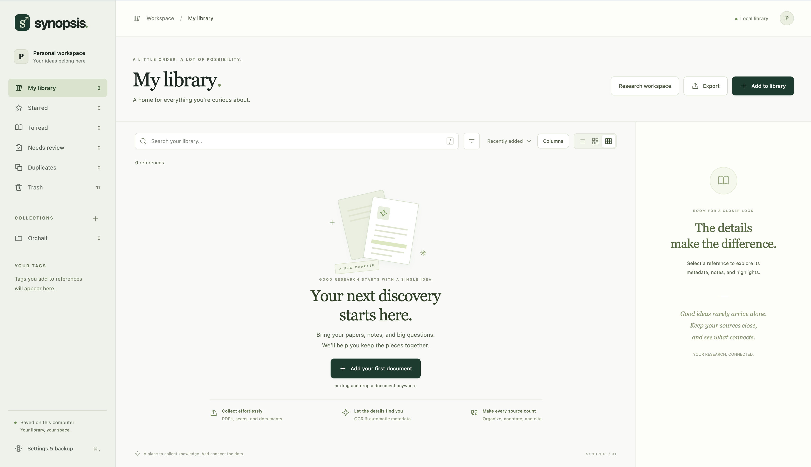

# Synopsis

A local-first research library built with **Python and Flask**, SQLite, and a browser interface. Add a document, extract or OCR its text, retrieve metadata from its DOI, and keep your references, notes, and citations together.

Synopsis includes a working library and an advanced research workspace, **not yet a complete Zotero replacement**. See [the feature matrix](docs/FEATURES.md) for implemented features and the remaining parity work.



## Run locally

Python 3.11+ and the Tesseract command-line engine are required. There is no Node.js or frontend build requirement.

```sh
# macOS
brew install tesseract

# Ubuntu/Debian alternative
# sudo apt-get install tesseract-ocr

python3 -m venv .venv
source .venv/bin/activate
pip install -r requirements.txt
python app.py
```

Open **http://127.0.0.1:5001**. The application uses Waitress and binds to the loopback interface. Change the port with `PORT=5002 python app.py`.

On Windows, install Tesseract and add it to PATH, then activate the environment with `.venv\Scripts\activate`. OCR settings show whether the engine is available. For additional OCR languages, install the corresponding Tesseract language data (`brew install tesseract-lang` on macOS); installed languages appear in Settings.

## Your first reference

1. Click **Add to library**, or drop documents anywhere on the page. Supported files: PDF, PNG, JPEG, TIFF, WebP, DOCX, UTF-8 TXT, and Markdown. A batch may contain up to 20 documents and 100 MB total.
2. The original file is saved immediately. A background job extracts text from every PDF page, using Tesseract on pages with little or no embedded text. Images and multi-page TIFFs are OCR'd. DOCX text and tables are extracted directly.
3. When a DOI is found near the beginning of the document, Synopsis queries Crossref for title, authors, year, publication, and other bibliographic fields. Without a matching DOI it uses embedded metadata and conservative text heuristics. Uncertain fields remain editable, and every processed document goes to **Needs review**.
4. Select the reference to review or edit metadata, add tags/collections, take notes, or open its original document and extracted text.
5. Use **Cite** for APA, MLA, Chicago author–date, or Vancouver bibliographies, or export selected references as BibTeX, RIS, or CSL-JSON.

The library starts empty. No sample references are inserted into your research.

## Advanced research workspace

Open **Research workspace** to use semantic search, source-linked questions and summaries, evidence notebooks, comparison matrices, an advanced reader, research graphs, version diffs, systematic reviews, watched folders, automation rules, and publication-status alerts. Optional generative AI supports configurable external or local compatible providers.

Read the [advanced feature guide](docs/ADVANCED.md) for workflows, provider configuration, source-validation behavior, and accuracy boundaries. The [test guide](docs/TESTING.md) explains what is verified and what requires real-corpus review.

## Storage and privacy

- SQLite metadata: `data/synopsis.sqlite3`; original documents: `data/uploads/`.
- Change **Settings & backup → Document storage → Upload folder** to save new documents elsewhere. Enter an absolute path or a path starting with `~`, or click **Browse…** to pick a folder with the operating system's native folder dialog (requires Tk on the computer running Synopsis). Missing folders are created and write access is checked when saving. This includes watched-folder imports. Existing documents stay in their original folders and remain readable. **Use default folder** resets the destination for future uploads. Keep old folders available while their documents remain in your library.
- Library backups include registered documents from all storage folders, excluding unrelated files. Restoring places the documents in the restored library's `uploads/` folder.
- Search includes bibliographic fields, extracted/OCR text, tags, notes, and highlights.
- OCR and semantic embedding inference run locally. DOI lookup, status checks, and citation discovery send identifiers to Crossref/OpenAlex when requested or enabled. Optional AI synthesis sends selected passages to the configured provider only when requested. See [processing controls](docs/ADVANCED.md).
- Identical files are detected with SHA-256 and are not stored twice in the active library.
- Processing failures retain the original attachment and display a retry option. Incomplete jobs resume when the app starts again. Manual field corrections are preserved during processing and retries.
- Use `SYNOPSIS_DATA_DIR=/absolute/path/to/library python app.py` to choose another storage directory.
- This release is a single-user application intended to run on localhost. It does not have accounts, remote authentication, cloud sync, or access control for multiple users. Keep the default loopback binding. A public deployment needs authentication, authorized file access, a durable job queue, resource isolation, and operational backups first.

## Backup and recovery

In **Settings & backup**, download a ZIP containing references, notes, highlights, collection hierarchy, OCR text, research workspace records, preferences, and original attachments. Bibliography exports are for exchanging citations; they do not include files or notes.

Restore a ZIP into a **new directory**:

```sh
source .venv/bin/activate
python manage.py restore /path/to/synopsis-backup.zip --data-dir ./recovered-library
SYNOPSIS_DATA_DIR=./recovered-library python app.py
```

The recovery command refuses to overwrite any existing directory and validates attachment paths. Restored watchers and generative AI are paused until you re-enable them. It constructs the recovered library in a temporary directory before making it available. For very large libraries, stop the application and copy the entire `data/` directory instead of generating an in-memory ZIP.

## Development and tests

```sh
source .venv/bin/activate
pip install -r requirements-dev.txt
python -m playwright install chromium
python -m pytest -q
```

Tests create isolated temporary libraries. See [the verification matrix](docs/TESTING.md) for the advanced tests. The core tests cover real image/scanned/mixed-PDF OCR, metadata extraction, preserved manual edits, original-file retention on errors, DOCX extraction, collections, searchable notes/highlights, citation styles, reference format round-trips, backup recovery, and a Chromium desktop/mobile workflow. OCR integration tests skip when Tesseract is unavailable. Browser test screenshots are written to `artifacts/`.

For UI development, restart `python app.py` after Python changes and refresh the browser for static files. Use a single server process: PDFium is accessed through one background worker because it is not thread-safe. Do not start multiple WSGI processes against the same library.

## Project structure

- `app.py`: local Waitress entry point and Flask application.
- `synopsis/__init__.py`: API, request validation, document access, and backup export.
- `synopsis/storage.py`: SQLite persistence and atomic record updates.
- `synopsis/processing.py`: background text extraction/OCR pipeline.
- `synopsis/metadata.py`: metadata heuristics and Crossref lookup.
- `synopsis/citations.py`: CSL bibliography formatting, BibTeX/RIS/CSL import/export.
- `templates/index.html`, `static/`: responsive, dependency-free browser UI.
- `synopsis/documents.py`: page geometry, OCR confidence, captures, and annotated-PDF export.
- `synopsis/intelligence.py`: local semantic retrieval and source-validated optional synthesis.
- `synopsis/research.py`: advanced research API.
- `synopsis/workflows.py`: systematic reviews, diffs, and research graph.
- `synopsis/services.py`: status/discovery services, folder intake, and organization rules.
- `static/research.js`, `static/research.css`: research workspace interface.
- `manage.py`: offline backup recovery.
- `tests/`: API, processing, storage, and browser integration tests.

## Current limits

OCR quality depends on scan quality and the installed language. Pages with at least 40 non-whitespace embedded characters use their existing text layer; image regions on those pages are not independently OCR'd. DOCX embedded images are not OCR'd. Handwriting, complex layouts, and encrypted PDFs need manual attention. DOI detection currently scans the first 20,000 extracted characters; metadata enrichment uses Crossref, not arbitrary title matching or ISBN/PubMed lookup.

The advanced reader supports geometric highlights and region comments and exports a new annotated PDF. Text without geometry remains explicitly unpositioned. Additional originals can be linked as attachments or versions. Search is aimed at personal libraries, not millions of records; semantic vectors are cached locally. Backups are generated in memory. The four built-in citation options use packaged CSL definitions through citeproc-py; verify publisher-specific formatting requirements before submission.

Built using [Flask](https://flask.palletsprojects.com/), [Tesseract](https://github.com/tesseract-ocr/tesseract), [pypdf](https://pypdf.readthedocs.io/), [pypdfium2](https://pypdfium2.readthedocs.io/), [Crossref](https://www.crossref.org/documentation/retrieve-metadata/rest-api/), and [citeproc-py](https://github.com/citeproc-py/citeproc-py).
